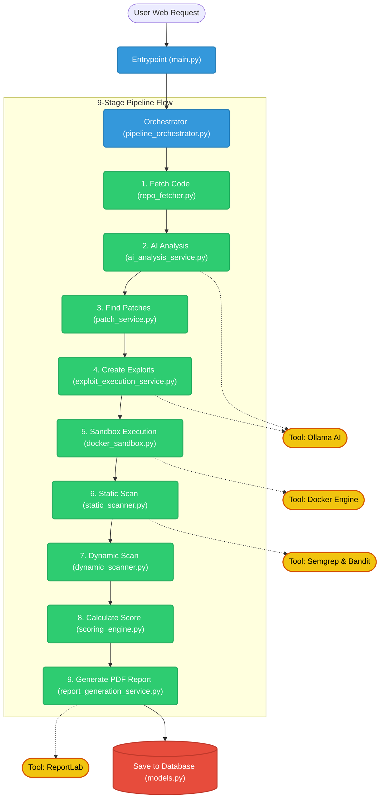

```mermaid
graph TD
    %% Simple and clean colors
    classDef api fill:#3498db,stroke:#2980b9,stroke-width:2px,color:white,rx:5,ry:5
    classDef stage fill:#2ecc71,stroke:#27ae60,stroke-width:2px,color:white,rx:5,ry:5
    classDef tool fill:#f1c40f,stroke:#d35400,stroke-width:2px,color:black,rx:15,ry:15
    classDef db fill:#e74c3c,stroke:#c0392b,stroke-width:2px,color:white

    User(["User Web Request"]) --> EntryAPI["Entrypoint (main.py)"]:::api
    EntryAPI --> Controller["Orchestrator (pipeline_orchestrator.py)"]:::api
    
    %% The linear pipeline
    subgraph "9-Stage Pipeline Flow"
        Controller --> S1["1. Fetch Code (repo_fetcher.py)"]:::stage
        S1 --> S2["2. AI Analysis (ai_analysis_service.py)"]:::stage
        S2 --> S3["3. Find Patches (patch_service.py)"]:::stage
        S3 --> S4["4. Create Exploits (exploit_execution_service.py)"]:::stage
        S4 --> S5["5. Sandbox Execution (docker_sandbox.py)"]:::stage
        S5 --> S6["6. Static Scan (static_scanner.py)"]:::stage
        S6 --> S7["7. Dynamic Scan (dynamic_scanner.py)"]:::stage
        S7 --> S8["8. Calculate Score (scoring_engine.py)"]:::stage
        S8 --> S9["9. Generate PDF Report (report_generation_service.py)"]:::stage
    end

    %% The distinct external tools (colored in Yellow)
    Ollama(["Tool: Ollama AI"]):::tool
    Docker(["Tool: Docker Engine"]):::tool
    Scanners(["Tool: Semgrep & Bandit"]):::tool
    ReportLab(["Tool: ReportLab"]):::tool

    %% How tools attach to stages
    S2 -.-> Ollama
    S4 -.-> Ollama
    S5 -.-> Docker
    S6 -.-> Scanners
    S9 -.-> ReportLab

    %% Data saving
    S9 --> Database[("Save to Database (models.py)")]:::db
```
