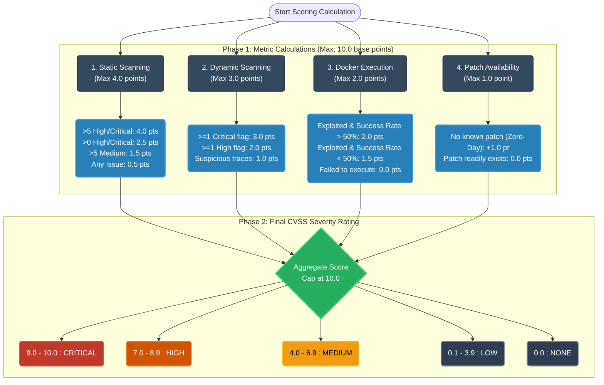

```mermaid
graph TD
    %% Styling Definitions
    classDef Engine fill:#34495e,stroke:#2c3e50,stroke-width:2px,color:white,rx:5,ry:5
    classDef points fill:#2980b9,stroke:#3498db,stroke-width:2px,color:white,rx:5,ry:5
    classDef sum fill:#27ae60,stroke:#2ecc71,stroke-width:3px,color:white,rx:15,ry:15
    classDef crit fill:#c0392b,stroke:#e74c3c,stroke-width:2px,color:white,rx:5,ry:5
    classDef high fill:#d35400,stroke:#e67e22,stroke-width:2px,color:white,rx:5,ry:5
    classDef med fill:#f39c12,stroke:#f1c40f,stroke-width:2px,color:black,rx:5,ry:5
    classDef low fill:#2c3e50,stroke:#7f8c8d,stroke-width:2px,color:white,rx:5,ry:5

    Input(["Start Scoring Calculation"]) --> Static 
    Input --> Dynamic
    Input --> Sandbox
    Input --> Patch

    %% Core Components Subgraph
    subgraph "Phase 1: Metric Calculations (Max: 10.0 base points)"
        
        Static["1. Static Scanning<br/>(Max 4.0 points)"]:::Engine
        Static --> St1(">5 High/Critical: 4.0 pts<br/>>0 High/Critical: 2.5 pts<br/>>5 Medium: 1.5 pts<br/>Any Issue: 0.5 pts"):::points

        Dynamic["2. Dynamic Scanning<br/>(Max 3.0 points)"]:::Engine
        Dynamic --> Dy1(">=1 Critical flag: 3.0 pts<br/>>=1 High flag: 2.0 pts<br/>Suspicious traces: 1.0 pts"):::points

        Sandbox["3. Docker Execution<br/>(Max 2.0 points)"]:::Engine
        Sandbox --> Sa1("Exploited & Success Rate > 50%: 2.0 pts<br/>Exploited & Success Rate < 50%: 1.5 pts<br/>Failed to execute: 0.0 pts"):::points

        Patch["4. Patch Availability<br/>(Max 1.0 point)"]:::Engine
        Patch --> Pa1("No known patch (Zero-Day): +1.0 pt<br/>Patch readily exists: 0.0 pts"):::points

    end

    %% Aggregation Step
    St1 --> SumNode{"Aggregate Score<br/>Cap at 10.0"}:::sum
    Dy1 --> SumNode
    Sa1 --> SumNode
    Pa1 --> SumNode

    %% Final Severity Outputs
    subgraph "Phase 2: Final CVSS Severity Rating"
        SumNode --> C("9.0 - 10.0 : CRITICAL"):::crit
        SumNode --> H("7.0 - 8.9 : HIGH"):::high
        SumNode --> M("4.0 - 6.9 : MEDIUM"):::med
        SumNode --> L("0.1 - 3.9 : LOW"):::low
        SumNode --> N("0.0 : NONE"):::low
    end
```
